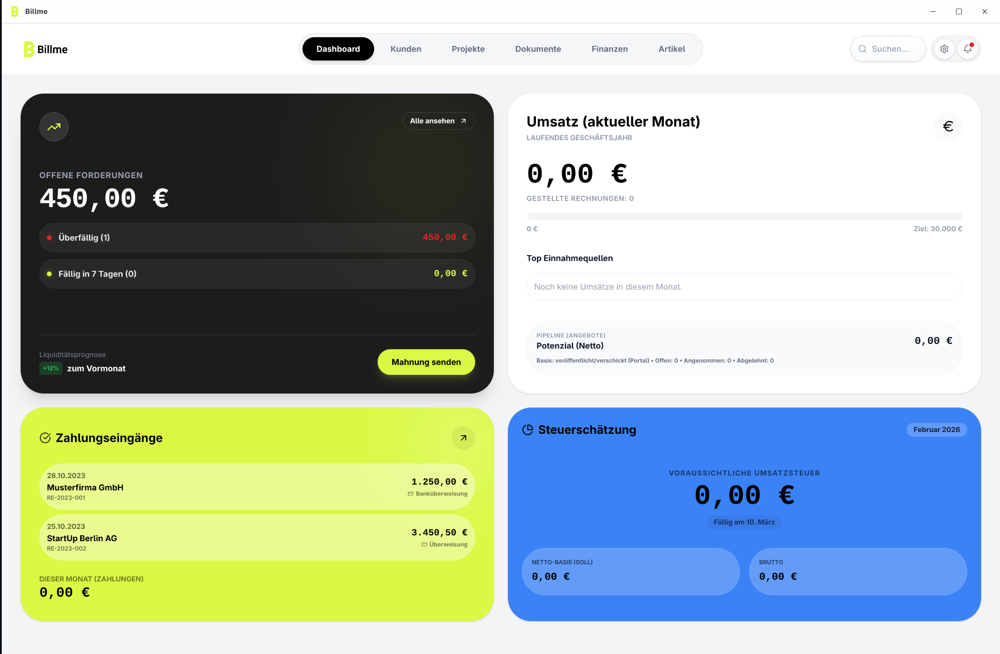

# Billme


A local-first invoicing desktop app (Electron + React + SQLite) and a public offer portal service.
Built with love in Germany.

Check out a web-hosted demo of the app here: [Demo](https://demo.getbillme.com/)).

PLEASE NOTE: This is still a Beta-Version. Expect some minor issues and please report them so they can be fixed!



## Features

- Visual invoice/offer editor with drag-and-drop canvas blocks, layers, and reusable templates
- Unified invoices/offers dashboard with search, status filters, portal sync, and offer-to-invoice conversion
- Recurring invoice profiles (`Abo-Rechnungen`) with interval scheduling and manual run support
- Bank transaction matching workflow to link payments and automatically update invoice payment status
- Client management with multiple contacts/addresses plus client-level revenue and outstanding metrics
- German-focused settings including payment terms, numbering, and optional ZUGFeRD EN16931 e-invoice export
- Public offer portal API for publishing offers/invoices, customer decision flows, and PDF access links

## GoBD

Billme includes technical controls that support GoBD-oriented workflows:

- Append-only audit log at DB level (update/delete blocked by SQL triggers)
- Hash-chained audit entries with built-in integrity verification
- Audit export as CSV for external review/documentation
- Mandatory reason prompts in key change/delete flows

Important: GoBD conformity is always process- and setup-dependent (including organizational controls and Verfahrensdokumentation). Billme does not claim an official GoBD certification by financial authorities.

## Workspace

- `apps/desktop`: Electron desktop app
- `apps/demo`: Cloudflare Worker-hosted browser demo (desktop UI + mock services)
- `apps/offer-portal`: Hono TypeScript service for published offers/invoices
- `packages/ui`: Shared UI components and utilities

## Prerequisites

- Node.js 20+
- `pnpm` 10+

## Getting Started

```bash
pnpm install
pnpm dev
```

This starts the desktop app in development mode.

## Common Commands

```bash
pnpm dev                 # Desktop app (Electron + renderer)
pnpm dev:demo            # Demo app (Cloudflare Worker)
pnpm dev:renderer        # Renderer only
pnpm build               # Build desktop bundles
pnpm build:demo          # Build demo frontend + typecheck worker
pnpm dist                # Build distributable desktop packages
pnpm -C apps/desktop test
pnpm -C apps/desktop typecheck
pnpm deploy:demo         # Deploy demo to Cloudflare Workers
pnpm -C apps/offer-portal dev
pnpm -C apps/offer-portal build
```

## Documentation

- `docs/architecture.md`
- `docs/offer-portal.md`
- `docs/releasing.md`

## License

MIT, see `LICENSE`.

## Notes

- Do not commit generated build output (`dist/`, `out/`, logs).
