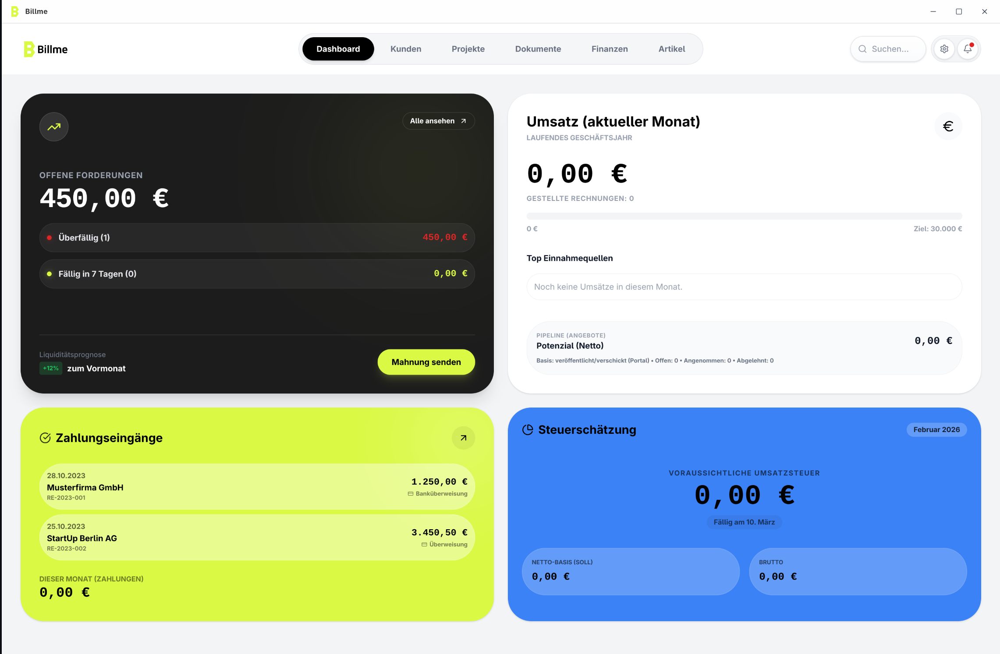

# Billme


**English** · [Deutsch](README.de.md)

[](https://github.com/bl4ckh4nd/billme/actions/workflows/ci.yml)
[](LICENSE)

Local-first invoicing and accounting for German small businesses — an Electron desktop app backed by
SQLite, an optional self-hosted server mode backed by Postgres, and a public portal for sharing offers
and invoices with customers. Built with love in Germany.

Try it without installing anything: **[demo.getbillme.com](https://demo.getbillme.com/)**

> **Beta.** Expect rough edges, and please report them so they can be fixed.



---

## What is Billme

Billme keeps your business data on your own machine. The desktop app writes to a local SQLite file —
no account, no cloud, no subscription server that can turn your invoices off. If you need multiple
users or browser access, you can run the same product as a self-hosted server-mode stack with Docker.

It is built specifically for the German market: ZUGFeRD/EN 16931 e-invoicing, Anlage EÜR with the
official line catalog, Mahnwesen, SKR03/SKR04 charts of accounts, DATEV export, and GoBD-oriented
audit controls.

---

## Editions

Billme ships as two separate applications. They install side by side, use **separate databases**, and
neither is a license-key upgrade of the other — the split happens at build time.

| | **Billme Lite** | **Billme Pro** |
|---|---|---|
| Desktop app | `apps/desktop` (`com.billme.desktop`) | `apps/pro-desktop` (`com.billme.pro`) |
| Browser shell (server mode) | `apps/web` — port 4175 | `apps/web-pro` — port 4176 |
| Local database | `billme.sqlite` | `billme-pro-v2.sqlite` |
| Focus | Invoicing, offers, Anlage EÜR | Double-entry bookkeeping, SKR, DATEV |
| Accounting screens | — | Inbox, booking editor, reconciliation, reports |

Pro is **not** a strict superset of the Lite UI: it replaces the Statistics and EÜR screens with the
double-entry accounting workspace. Pick Lite if you file an Einnahmen-Überschuss-Rechnung, Pro if you
keep double-entry books.

### Deployment models

| Mode | What it is | Data lives in |
|---|---|---|
| **Desktop** | Electron app, single business per install | Local SQLite |
| **Server mode** | Docker stack: Postgres + API + worker + two browser shells, multi-user with roles | Postgres |
| **Demo** | The real desktop UI running in a browser against mock data | Nothing — in-memory, per session |
| **Offer portal** | Public Hono service for customer-facing offer/invoice links | Its own snapshot store |

---

## Features

### Documents and billing — Lite and Pro

- **Visual document designer** — drag-and-drop canvas, element rail, inspector, layers panel, rulers,
  snapping, undo/redo, and reusable templates for invoices and offers
- **Unified documents dashboard** — search, status filters, portal sync state, offer-to-invoice conversion
- **Recurring invoices** (`Abo-Rechnungen`) — interval scheduling with manual runs
- **Mahnwesen** — multi-level dunning with configurable fees and preview
- **Clients** with multiple structured addresses and contacts, plus per-client revenue and outstanding metrics
- **Projects** and an **article catalog** with per-article VAT
- **Bank CSV import** (papaparse + iconv-lite, handles German bank encodings) and **transaction matching**
  that links payments and updates invoice payment status
- **Statistics and finance hub**, onboarding wizard, backup/restore, email sending, auto-updater

### German compliance — Lite and Pro

- **ZUGFeRD / EN 16931 e-invoicing** — XML generation plus embedding into the PDF. Conformance is
  verified in CI against Mustang CLI (profile E) and veraPDF for PDF/A — see `.github/workflows/einvoice-validation.yml`
- **Anlage EÜR** — official 2025 line catalog (`packages/desktop-services/src/eur/lines-2025.json`), classification
  pipeline, keyword suggestions, and a printable EÜR document *(Lite; Pro replaces this with double-entry)*
- **Tax modes** including Kleinunternehmer §19, with immutable tax snapshots stored on each document
- **Append-only audit log** enforced by SQL triggers, hash-chained with built-in integrity verification

### Pro accounting — Pro only

- **Double-entry bookkeeping** — booking drafts to posted journal entries with debit/credit lines.
  Entries must balance before posting (`UNBALANCED_ENTRY` is a hard block), corrections happen through
  reversal with a mandatory reason, never deletion
- **SKR03 / SKR04** — the full German chart of accounts ships bundled with the installer and is imported
  on first launch; re-importable from the UI
- **14 German tax cases** — §19 Kleinunternehmer, §13b reverse charge, §25a Differenzbesteuerung,
  §48 Bauabzugsteuer, §25b Dreiecksgeschäft, OSS B2C, intra-community supply/acquisition, third-country
  export, and more — with per-chart account mappings including DATEV BU-Schlüssel and `validFrom`/`validTo` versioning
- **Compliance validation before posting** — blocking and non-blocking issues, e.g. missing counterparty
  VAT ID or missing evidence
- **DATEV Buchungsstapel export** — EXTF header, 12 columns, CP1252 + BOM, DDMMYYYY dates, with field
  validation that aborts the export rather than writing a malformed file
- **Accounting periods** (open / soft-locked / closed) and an 11-state booking workflow with dual-control
  gates: submit for review, approve, reject, post, reverse, create correction
- **Automatic account suggestions, entirely local** — a five-stage cascade of rule → counterparty memory →
  naive Bayes → keyword → fallback, with the confidence and reason surfaced in the UI. The classifier
  trains on your own booking history. No cloud AI, no data leaves the machine
- **Betriebsprüfung export package** — one command produces JSONL exports of journal, lines, periods,
  mappings and audit log with a SHA-256 per file and a manifest
- **Database-level immutability** — SQL triggers protect `journal_entries`, `journal_lines` and
  `datev_exports` against update and delete (Lite protects only `audit_log`)
- **Role gates** on posting, reversal, DATEV export and audit export
- **SuSa, GuV and Bilanz** — the report engine is implemented and exposed over IPC; wiring the shared
  accounting UI to it is still in progress, so those screens currently render sample data

### Server mode — Lite and Pro

- Multi-user with roles (`owner`, `admin`, `accountant`, `sales`, `viewer`)
- Product-isolated auth — a Lite token on a Pro route is rejected with `403`
- Background worker for recurring invoices, dunning, queued email, portal sync and maintenance
- Client, invoice, offer and recurring-profile writes and deletes require a `reason` and append a
  hash-chained audit entry in the same transaction (settings, numbering and Pro catalog routes do not yet)
- `billme` CLI for scripting against the API
- One-way import of an existing desktop SQLite database into Postgres

> The Lite browser shell intentionally exposes a reduced menu — Dashboard, Clients and Documents only.
> Projects, Finance and Articles are desktop-only in Lite. The Pro browser shell has its own full UI
> including the accounting workspace.

---

## Installation

### Desktop

Download the installer for your platform from the [latest release](https://github.com/bl4ckh4nd/billme/releases/latest).
Lite and Pro are published as separate artifacts.

| Platform | Format |
|---|---|
| Windows | NSIS installer (`.exe`) |
| macOS | `.dmg` and `.zip` |
| Linux | `.AppImage` and `.deb` |

### Demo

No installation — open [demo.getbillme.com](https://demo.getbillme.com/). Data is per-session and
in-memory; resetting the session wipes it.

---

## Server mode (Docker)

```bash
cp .env.server-mode.example .env.server-mode
# edit BILLME_POSTGRES_PASSWORD and BILLME_SESSION_SECRET
pnpm docker:server-mode
```

Then open the Lite shell at <http://localhost:4175> or the Pro shell at <http://localhost:4176> and
complete the first-owner bootstrap. API health: <http://localhost:3100/health>.

### Services

| Service | Image / build | Host port |
|---|---|---|
| `postgres` | `postgres:16-alpine` | `BILLME_POSTGRES_PORT` (5432) |
| `server-api` | `apps/server-api` — Fastify | `BILLME_API_PORT` (3100) |
| `server-worker` | `apps/server-worker` | — |
| `web` | `apps/web` → nginx | `BILLME_WEB_PORT` (4175) |
| `web-pro` | `apps/web-pro` → nginx | `BILLME_WEB_PRO_PORT` (4176) |

```bash
pnpm docker:server-mode:logs   # follow api + worker
pnpm docker:server-mode:down
```

### Configuration

Key variables in `.env.server-mode` — see `.env.server-mode.example` for the full list:

| Variable | Default | Meaning |
|---|---|---|
| `BILLME_POSTGRES_PASSWORD` | `change-me` | Database password |
| `BILLME_SESSION_SECRET` | — | HMAC secret for session tokens |
| `BILLME_PUBLIC_API_URL` | `http://localhost:3100` | API URL the browsers call |
| `WORKER_*_INTERVAL_MS` | see below | Job intervals |
| `SMTP_PASSWORD` / `RESEND_API_KEY` | — | Outgoing email credentials |

Three things worth knowing before you deploy:

1. **`BILLME_PUBLIC_API_URL` is baked into the browser images at build time.** Changing it requires
   `docker compose --env-file .env.server-mode -f docker-compose.server-mode.yml build web web-pro`.
2. **Set `BILLME_SESSION_SECRET`.** If it is empty the API silently falls back to a well-known
   development secret, which means anyone can forge a session token.
3. **Postgres is published to the host by default.** Remove the port mapping for anything
   internet-facing. The stack speaks plain HTTP and ships no reverse proxy or TLS termination —
   put one in front of it yourself.

### Worker jobs

| Job | Default interval |
|---|---|
| `recurring-invoices` | 15 min |
| `dunning` | 15 min |
| `queued-email-dispatch` | 1 min |
| `offer-portal-sync` | 1 min |
| `scheduled-maintenance` | 24 h |

Set `WORKER_RUN_ONCE=1` to run every job once and exit — useful for debugging and E2E runs.

### `billme` CLI

`packages/server-cli` provides a typed HTTP client and the `billme` binary. Named profiles are stored
in `~/.config/billme/server-cli.json`.

```
billme auth       login | bootstrap | me
billme meta       health | capabilities
billme clients    list | get | upsert | delete
billme invoices   list | get | create | upsert | delete
billme offers     list | get | create | upsert | delete
billme recurring  list | get | upsert | delete
billme settings   get | set
billme numbers    reserve | release | finalize
billme documents  export-json | export-csv
billme pro        articles | accounts | templates
```

### Migrating from desktop

```bash
DATABASE_URL=... SQLITE_PATH=/path/to/billme.sqlite SERVER_PRODUCT=lite \
  pnpm -C packages/server-data import:sqlite
```

Full walkthrough, Podman notes and E2E details: [`docs/server-mode-docker.md`](docs/server-mode-docker.md).

---

## GoBD

Billme includes technical controls that support GoBD-oriented workflows:

- Append-only audit log at DB level — update and delete blocked by SQL triggers, in both SQLite and Postgres
- Hash-chained audit entries with built-in integrity verification
- Mandatory reason prompts in the key document and client change/delete flows, on desktop and in the server API
- Audit export as CSV for external review, plus the Pro Betriebsprüfung package with per-file checksums
- Pro additionally protects journal entries, journal lines and DATEV exports against modification at the database level

**Important:** GoBD conformity is always process- and setup-dependent, including organizational controls
and a Verfahrensdokumentation. Billme does not claim an official GoBD certification, and the project's
own compliance checklist rates every clause (HGB §238, AO §146/§147, GoBD, UStG §14, DATEV) as *partial* —
notably there is no year-end closing control path, no enforced receipt-to-booking linkage, and no
retention policy engine yet. Treat this as engineering support, not legal advice.

---

## Offer portal

`apps/offer-portal` is a Hono service that publishes offers and invoices as customer-facing links and
collects decisions. The desktop and server apps push snapshots to it and remain the source of truth —
the portal never holds accounting truth.

It runs either self-hosted on Node or on Cloudflare Workers, with storage adapters for in-memory,
SQLite + filesystem, or D1 + R2. Publishing is protected by an `x-api-key`; customer URLs are token-based.
It is deliberately **not** part of the server-mode Docker stack.

See [`docs/offer-portal.md`](docs/offer-portal.md).

---

## Roadmap — not yet in this repository

These are described in internal design docs but are not on `main`; do not expect to find them after cloning.

- **Mobile app** — an Expo / React Native client (SDK 57, RN 0.86, expo-router) for iOS and Android that
  acts as an action cockpit against server mode rather than a shrunken desktop UI. Sign-in by password or
  by scanning a QR pairing code; tokens in the OS secure store with a biometric gate; locally only an
  encrypted cache, drafts and an upload outbox. Lives on the unmerged `feat/ux-audit-improvements` branch.
  Prototype status: no release, no store listing.
- **Platform admin console** — a minimal web console for provisioning workspaces and users in server mode.
- **Agent control** — a typed action catalog and token-protected loopback bridge for local automation.

---

## Workspace

### Apps

| Path | What it is |
|---|---|
| `apps/desktop` | Lite Electron + React desktop app; owns Electron main/preload, SQLite connection, Lite product wiring |
| `apps/pro-desktop` | Pro Electron + React desktop app; adds the accounting UI, engine, Pro contracts and Pro schema |
| `apps/web` | Lite browser shell for server mode — remounts the Lite desktop renderer over an HTTP adapter |
| `apps/web-pro` | Pro browser shell for server mode — standalone UI embedding the accounting workspace |
| `apps/server-api` | Fastify server-mode API backed by Postgres |
| `apps/server-worker` | Background worker for recurring invoices, dunning, email, portal sync, maintenance |
| `apps/offer-portal` | Hono service for public offer/invoice sharing and customer decisions |
| `apps/demo` | Cloudflare Worker demo — shared renderer with session-scoped mock services |
| `apps/landing-page` | Marketing site |

### Packages

| Package | What it is |
|---|---|
| `@billme/ui` | Base design system primitives and the design-token source of truth (`packages/ui/styles.css`) |
| `@billme/desktop-contracts` / `-pro` | Typed IPC contracts and Zod schemas for the Lite and Pro renderer/main boundaries |
| `@billme/desktop-core` | Shared desktop runtime helpers — IPC error handling, logging/retry, email service, notification state |
| `@billme/desktop-data` | Shared SQLite lifecycle/repositories, transaction matching, validation, backup, audit, EÜR and dunning seams |
| `@billme/desktop-designer` | The shared visual document designer — canvas stage, element rail, inspector, layers, plus zoom/pan/history hooks |
| `@billme/desktop-renderer` | Shared Lite/Pro views, query hooks, UI state, product-aware API fallback, print shell and host mounting |
| `@billme/desktop-services` | Product-parameterized mock engine/data, portal client, CSV import, EÜR catalog and suggestion helpers |
| `@billme/desktop-hooks` / `-state` / `-ui` / `-utils` | Small shared pieces: keyboard shortcuts hook, Zustand UI store, toast/spinner/skeleton, formatters |
| `@billme/accounting-shared` | Pure Pro accounting types — journal, workflow states, ledger charts, tax cases |
| `@billme/accounting-engine` | Posting and ledger services, including the balance check enforced before posting |
| `@billme/accounting-ui-pro` | The Pro accounting workspace UI — inbox, booking editor, reconciliation, exceptions, reports |
| `@billme/finance-intelligence` | Local naive Bayes classifier and German keyword heuristics for account suggestions |
| `@billme/server-core` | Product/runtime schemas, typed API client, domain types, tax/e-invoice logic, shared services |
| `@billme/server-data` | Postgres schema, migrations, repositories, seeding and SQLite import tooling |
| `@billme/server-cli` | Typed server-mode HTTP client plus the `billme` CLI binary |

---

## Development

### Prerequisites

- Node.js 20+
- pnpm 10+

```bash
pnpm install
pnpm dev          # starts the Lite desktop app
```

### Commands

```bash
# Development
pnpm dev                  # Lite desktop app
pnpm dev:pro              # Pro desktop app
pnpm dev:renderer         # Lite renderer only (Vite)
pnpm dev:web              # Lite browser shell
pnpm dev:web-pro          # Pro browser shell
pnpm dev:server-api       # Fastify API
pnpm dev:server-worker    # Background worker
pnpm dev:demo             # Cloudflare Worker demo
pnpm dev:landing          # Landing page

# Build
pnpm build                # Lite desktop bundle
pnpm build:web            # Lite browser shell
pnpm build:web-pro        # Pro browser shell
pnpm build:server-api
pnpm build:server-worker
pnpm build:server-cli
pnpm build:demo
pnpm build:landing

# Distributables
pnpm dist                       # Lite desktop installers
pnpm -C apps/pro-desktop dist   # Pro desktop installers

# Server-mode stack
pnpm docker:server-mode
pnpm docker:server-mode:logs
pnpm docker:server-mode:down

# Deploy
pnpm deploy:demo                     # demo to Cloudflare Workers
pnpm -C apps/offer-portal deploy:cf  # offer portal to Cloudflare Workers
```

Typechecking is per package, e.g. `pnpm -C apps/desktop typecheck`.

---

## Testing

Tests live next to the code; the root `tests/` directory is end-to-end only. There is no single root
test command that fans out across the workspace — run the surface you touched.

```bash
# Unit — Vitest (the two Electron apps)
pnpm -C apps/desktop test
pnpm -C apps/pro-desktop test
pnpm -C apps/desktop test:einvoice     # ZUGFeRD conformance subset

# Unit — Node built-in test runner (everything else)
pnpm -C apps/server-api test
pnpm -C apps/server-worker test
pnpm -C apps/offer-portal test
pnpm -C packages/server-data test
pnpm -C packages/server-cli test

# End-to-end — Playwright
pnpm test:e2e:smoke
pnpm test:e2e:full
pnpm test:e2e:server:install   # one-time: playwright install chromium
pnpm test:e2e:server:smoke
pnpm test:e2e:server:full
```

Server-mode E2E needs Docker or Podman plus a local Chromium. The suite brings up its own isolated
stack, so `.env.server-mode` is only needed for manual Compose runs.

### CI

| Workflow | Trigger | What it does |
|---|---|---|
| `ci.yml` | push / PR | Shared desktop-data/renderer tests; Lite + Pro typecheck, tests, e-invoice tests and build; offer-portal build; desktop smoke E2E; server-mode smoke E2E |
| `e2e-nightly.yml` | nightly | Full desktop and full server-mode E2E |
| `einvoice-validation.yml` | e-invoice changes | ZUGFeRD validation via Mustang CLI and PDF/A via veraPDF |
| `commitlint.yml` | push / PR | Conventional Commit enforcement |
| `release-please.yml` | push to `main` | Opens and maintains the release PR |
| `publish-release.yml` | tag `v*` | Builds Lite and Pro on Linux, macOS and Windows, publishes the GitHub release |

---

## Contributing

Commits follow [Conventional Commits](https://www.conventionalcommits.org/) and this is enforced in CI:

```
<type>: <subject>
```

Allowed types: `build`, `chore`, `ci`, `docs`, `feat`, `fix`, `perf`, `refactor`, `revert`, `style`, `test`.

Releases are automated: release-please opens a version PR from the commit history, merging it creates a
tag, and the tag triggers the cross-platform build and GitHub release.

Do not commit generated build output (`dist/`, `out/`, `release/`, coverage, logs).

---

## Documentation

- [`docs/server-mode-docker.md`](docs/server-mode-docker.md) — server-mode stack, Docker/Podman, E2E harness
- [`docs/offer-portal.md`](docs/offer-portal.md) — offer portal run and deploy details
- [`docs/releasing.md`](docs/releasing.md) — release process
- [`docs/eur-integration-plan.md`](docs/eur-integration-plan.md) — EÜR integration notes
- [`docs/architecture.md`](docs/architecture.md) — early architecture notes for the Lite desktop app,
  the demo and the portal (predates the Pro and server-mode surfaces)

---

## License

[Functional Source License 1.1 with an Apache 2.0 future license](LICENSE) (FSL-1.1-ALv2). You may use,
modify and redistribute Billme for any purpose except building a competing product; each release
converts to Apache 2.0 two years after publication.
